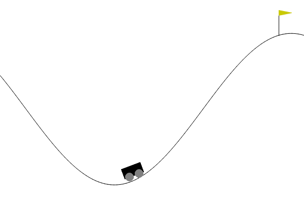

# Solving `MountainCarContinuous-v0` with Soft Actor-Critic (SAC)

## About
This project addresses solving the [`MountainCarContinuous-v0`](https://gymnasium.farama.org/environments/classic_control/mountain_car_continuous/) environment in OpenAI Gym using the **Soft Actor-Critic (SAC)** algorithm. The reward structure has been modified to encourage faster convergence and optimize agent performance. By applying SAC, this project explores the effectiveness of entropy-regularized policies in environments with continuous action spaces.

Reward modifications aim to address specific challenges in the environment, such as encouraging the car to overcome inertia and reach the goal state efficiently. Performance is evaluated based on achieving an average reward of 82 over 150 consecutive episodes.

For more details on SAC, refer to the [https://arxiv.org/abs/1812.05905](https://proceedings.mlr.press/v80/haarnoja18b/haarnoja18b.pdf) by Tuomas Haarnoja, Aurick Zhou, Pieter Abbeel, and Sergey Levine.

---

## Getting Started
### Installation
1. Clone the repository:
   ```bash
   git clone https://github.com/shahrajabian/SAC_MountainCarContinuous.git
   cd SAC_MountainCarContinuous
## Animation of the Learned Agent


